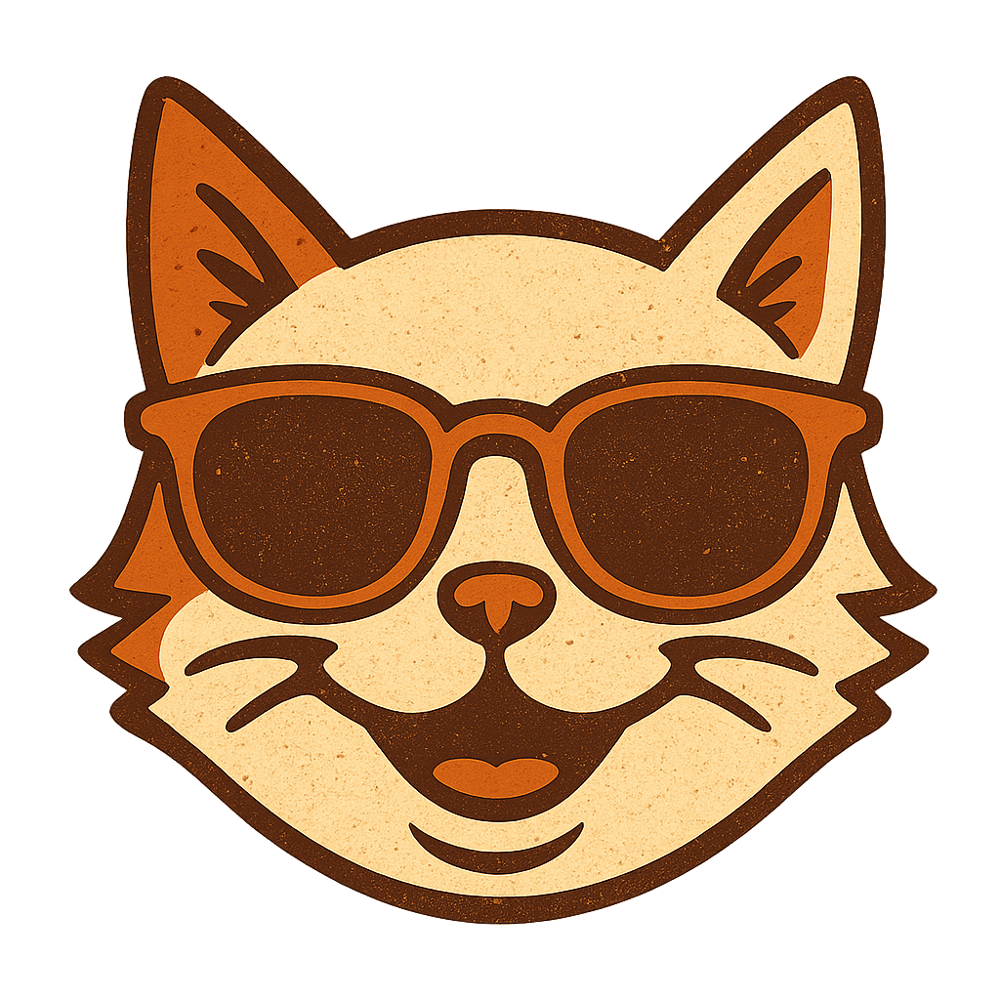

<span>
  
  
</span>


# Meow Muse

**Meow Muse** is proof of concept application that allows users to chat with an AI Assistant about their cat's health. The AI uses RAG and only returns an answer if relevant data exists in the vector database.

**NOTE:** If the Meow Muse UX/UI looks similar to the ApplyWize Redwood SDK Tutorial App - that's because it is 😺.

## Stack
- Meow Muse is built with the [Redwood SDK](https://rwsdk.com/). See the section below and their docs for more information.

## AI Model and Tools

- This application uses Cloudflare AI for chat, specifically [Llama 4 Scout](https://developers.cloudflare.com/workers-ai/models/llama-4-scout-17b-16e-instruct/).
- Because the vector database (Qdrant) was originally created with OpenAI Embeddings, the AI Agent
uses the same.

**NOTE:** The code for RAG data ingestion is not in this repository. I recommend the sources below if you want to re-create this application.

## RAG Data

The data in Qdrant comes from the following sources:

- Cornell University College of Veterinary Medicine
- Pet MD
- Merck Manual
- BSAVA Manual of Feline Veterinary Practice
- AAFP

## To Do

- Clean up ingested data (remove any unnecessary HTML tags, etc.)
- Add more indexes/filters to Qdrant
- Move from Qdrant to Cloudflare Vectorize
- Use Cloudflare AutoRAG
- Figure out the best way to handle tool calling - does not currently work (see comments in code).
- Use BetterAuth for AuthN/AuthZ
- General user interface cleanup
- Known issue: Hot reload on the Chat page can sometimes lead to infinite refreshes.

## Other

- To see images on localhost, I suggest you upload one to the bucket and then change the `src` ref in the `img` tag in the `ChatBox` component. Right now it is set to: `https://pub-a61e40a1c173478f9ec99627cd03a855.r2.dev/siamese.jpeg`

---

# Standard RedwoodSDK Starter

This "standard starter" is the recommended implementation for RedwoodSDK. You get a Typescript project with:

- Vite
- database (Prisma via D1)
- Session Management (via DurableObjects)
- Passkey authentication (Webauthn)
- Storage (via R2)

## Creating your project

```shell
npx degit redwoodjs/sdk/starters/standard my-project-name
cd my-project-name
pnpm install
```

## Running the dev server

```shell
pnpm dev
```

Point your browser to the URL displayed in the terminal (e.g. `http://localhost:5173/`). You should see a "Hello World" message in your browser.

## Deploying your app

### Wrangler Setup

Within your project's `wrangler.jsonc`:

- Replace the `__change_me__` placeholders with a name for your application

- Create a new D1 database:

```shell
npx wrangler d1 create my-project-db
```

Copy the database ID provided and paste it into your project's `wrangler.jsonc` file:

```jsonc
{
  "d1_databases": [
    {
      "binding": "DB",
      "database_name": "my-project-db",
      "database_id": "your-database-id",
    },
  ],
}
```

### Authentication Setup

For authentication setup and configuration, including optional bot protection, see the [Authentication Documentation](https://docs.rwsdk.com/core/authentication).

## Further Reading

- [RedwoodSDK Documentation](https://docs.rwsdk.com/)
- [Cloudflare Workers Secrets](https://developers.cloudflare.com/workers/runtime-apis/secrets/)
